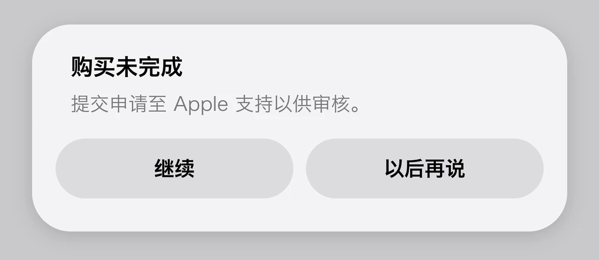
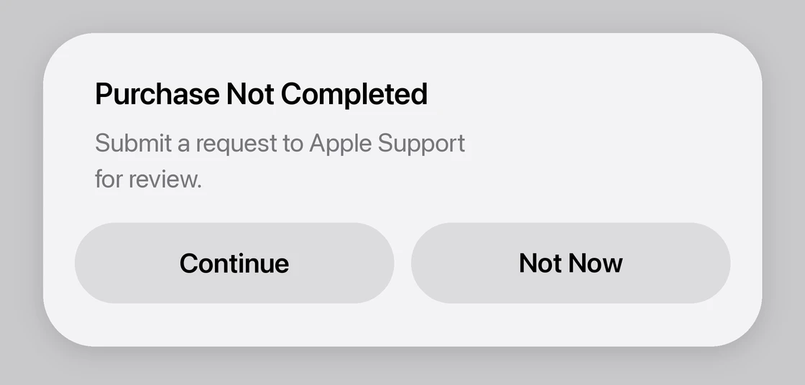
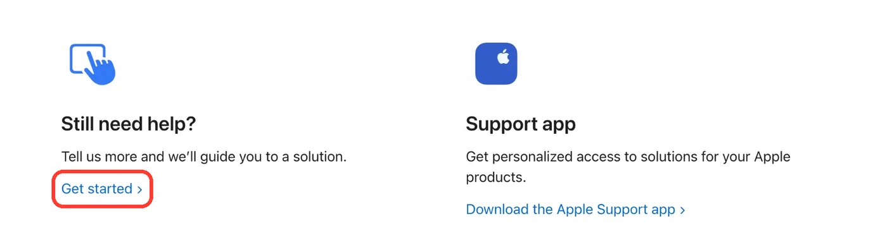
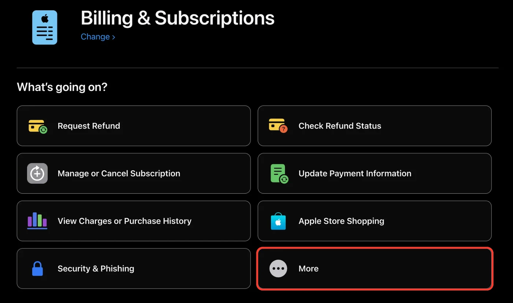
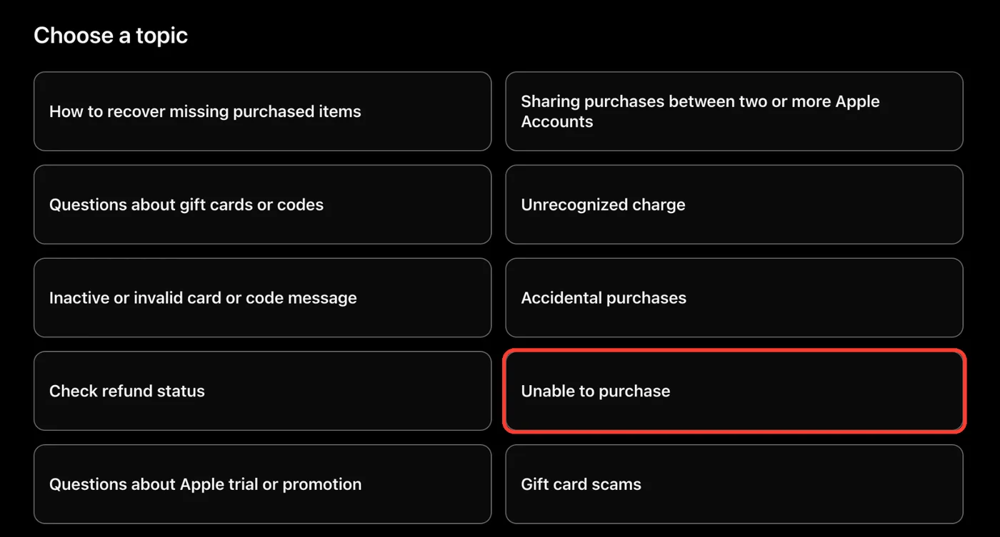
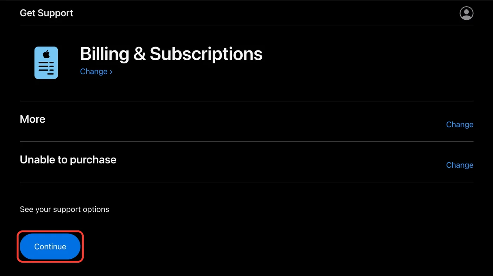
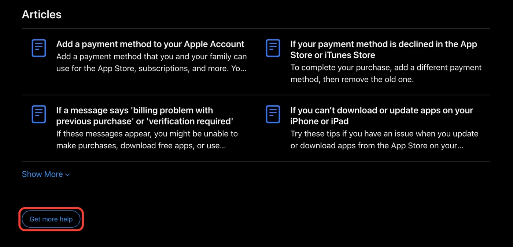
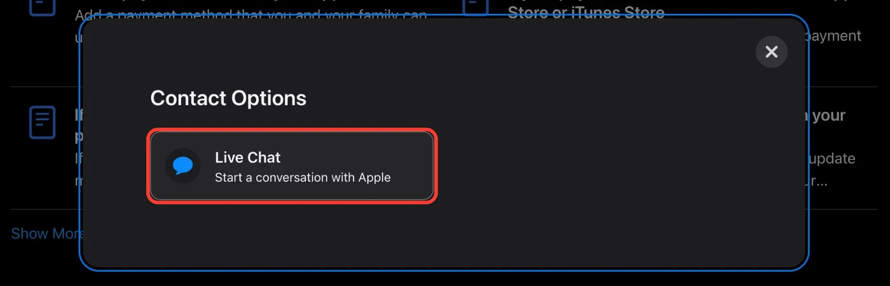
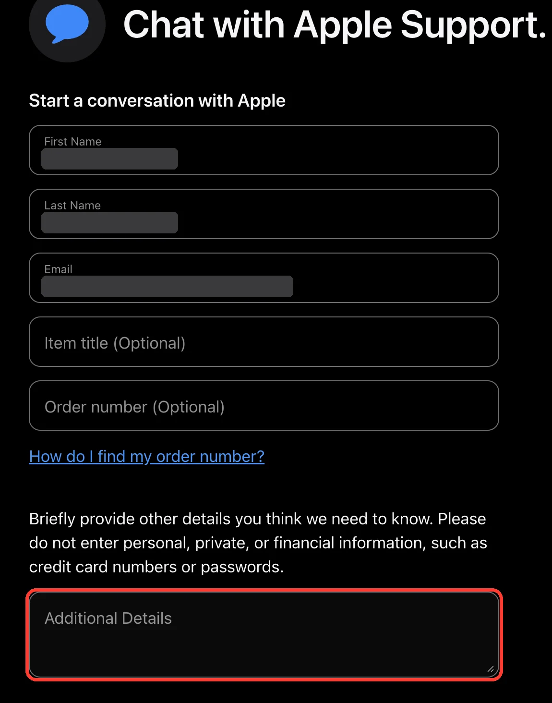
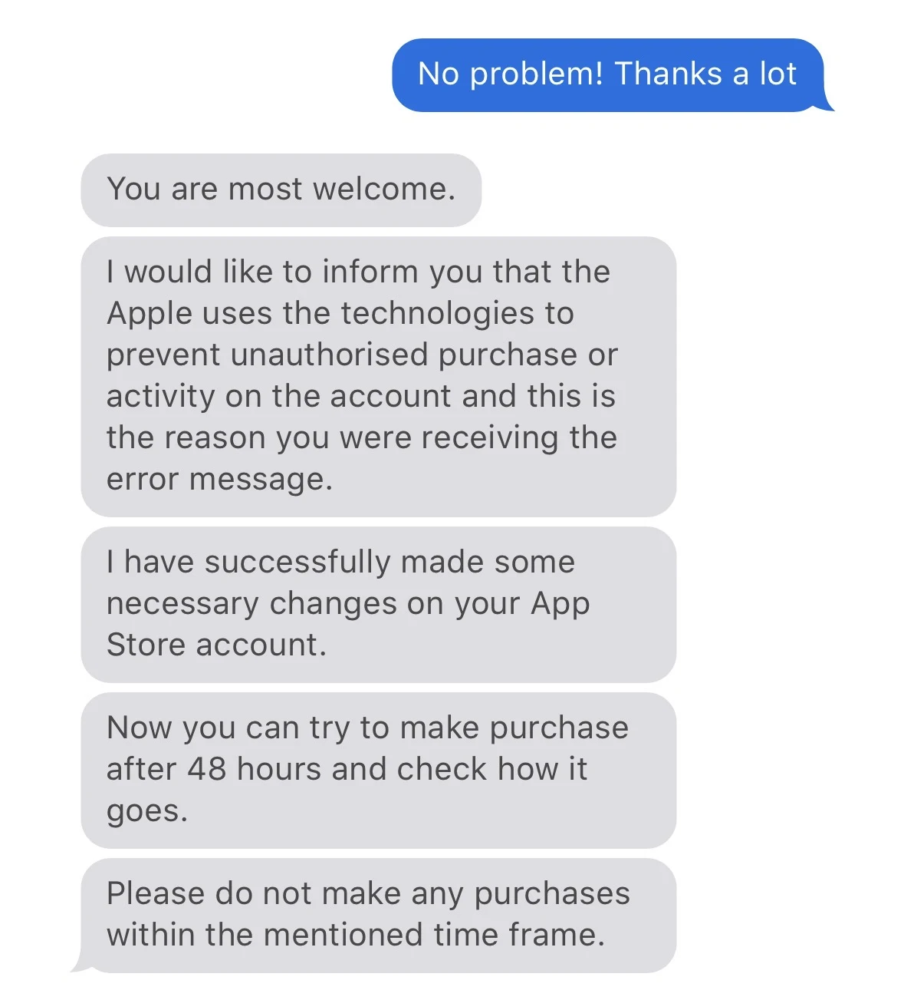

# 「购买未完成，提交申请至 Apple 支持以供审核」怎么办？礼品卡订阅 ChatGPT Plus / Pro 被拦的处理办法（2026）

> **最后更新：2026 年 10 月 5 日（北京时间）** · 报错原文和 Apple 支持页的入口当天核对。案例来自作者本人和公开帖子，都标了日期和出处。

用美区礼品卡余额在 iPhone 上订阅 ChatGPT Plus 或 Pro，付款时弹出「购买未完成，提交申请至 Apple 支持以供审核」，或者英文的 Purchase Not Completed、Your Purchase Could Not Be Completed。这篇讲它是什么、该怎么处理、要等多久。

## 先说结论

- **这是 Apple 的购买审核。** 余额没有问题，ChatGPT 也没有问题。作者遇到时，Apple 客服的解释是：Apple 用技术手段防止未经授权的购买，所以弹了这条提示。
- **马上停手。** 别再点订阅，别再兑换新的礼品卡，别换账号重试。多位用户反映，等待期间每试一次，时间会重新算。
- **提交一次申请，然后等 48–72 小时。** 点弹窗里的「继续」，或者自己找 Apple 在线客服，二选一，做一次就够。多数案例在 72 小时前后恢复。
- **有人等完也没恢复。** 公开帖子里有人等了三四轮还不行，少数人的 Apple 账户被停用。金额越大越常见：不少人订 Plus 没事，升级 Pro 时被拦。
- 不想等，或者等了还不行，可以[换一条路](#不想等怎么办)。

~~~mermaid
flowchart LR
    A[弹出购买未完成] --> B[停手：不再点、不再充]
    B --> C[提交一次申请 点继续或找在线客服]
    C --> D[等 48–72 小时 期间不做任何购买]
    D --> E{再试一次}
    E -->|成功| F[完成]
    E -->|还是不行| G[再找客服、继续等 或换一条路]
~~~

## 目录

- [你看到的是哪一条提示](#你看到的是哪一条提示)
- [为什么会被拦](#为什么会被拦)
- [处理步骤](#处理步骤)
- [聊天时用得上的话](#聊天时用得上的话)
- [等待期间能做什么](#等待期间能做什么)
- [要等多久：8 个案例](#要等多久8-个案例)
- [升级 Pro 时被拦](#升级-pro-时被拦)
- [两个风险](#两个风险)
- [不想等怎么办](#不想等怎么办)
- [下次怎么少遇到](#下次怎么少遇到)
- [常见问题](#常见问题)
- [English summary](#english-summary)
- [资料来源与更新记录](#资料来源)

## 你看到的是哪一条提示

下面几条是同一件事的不同写法，处理办法相同。

### 购买未完成：提交申请至 Apple 支持以供审核

中文界面，目前最常见。按钮是「继续」和「以后再说」。

  

图 1：中文界面的提示（示意图，按提示原文绘制）。

### Purchase Not Completed: Submit a request to Apple Support for review

上一条的英文界面，按钮是 Continue 和 Not Now。Apple 社区里还有一种写法：`Purchase Not Completed. Contact Apple Support for assistance.`

  

图 2：英文界面的提示（示意图，按提示原文绘制）。

### 你的购买无法完成，请联系 iTunes 支持（Your Purchase Could Not Be Completed）

~~~text
Your Purchase Could Not Be Completed
For assistance, contact iTunes Support at www.apple.com/support/itunes/ww/.

[ OK ]
~~~

中文界面显示为「你的购买无法完成。如需帮助，请联系 iTunes 支持」，也有写成「您的购买无法完成」的。

这一条比较笼统，付款方式失效、账户地区不符时也会出现。如果你用的是礼品卡余额，余额足够，地区也没问题，多半和前两条是同一件事。

### 不是本文讲的情况

订阅按钮是灰的，提示 `In-app purchases are currently unavailable`。那是 App 内购还没开通，和购买审核无关。

## 为什么会被拦

Apple 没有公开规则。能确定的只有一点：这是防盗刷的自动审核。作者当时问在线客服，对方的原话是：

> Apple uses the technologies to prevent unauthorised purchase or activity on the account and this is the reason you were receiving the error message.

下面几条是公开帖子里反复出现的规律，Apple 没有确认过：

- 金额大。Plus $20 也有人被拦，但升级 Pro 这类一百美元以上的更常见。我们接到的咨询里，不少是 Plus 用户升级 Pro 时遇到的。
- 账户新，或者刚改过地区和账单地址，当天充值当天就订阅。
- 连续点了好几次。
- 一位用户转述电话客服的说法：这是一种随机抽查，绑定的手机号地区和 Apple 账户地区不一致时可能触发（[出处](https://linux.do/t/topic/2848813)）。只有这一个来源。

## 处理步骤

### 第 1 步：停手

关掉弹窗后先什么都别做。不再点订阅，不再兑换礼品卡，不换 Apple 账户重试。

### 第 2 步：提交一次申请

两种方式选一种，做一次就够，反复提交没有用。

**方式 A：点弹窗里的「继续」。** 它会打开 Apple 的支持流程，按页面要求如实提交。有用户反映点了以后一直转圈打不开（[出处](https://linux.do/t/topic/2848813)），那就用方式 B。你看到的弹窗只有 OK 按钮的话，也用方式 B。

**方式 B：自己找 Apple 在线客服。** 很多人卡在这里：Apple 的支持页不会直接给聊天按钮，要按下面的顺序一层层点进去。截图是 10 月 5 日实际操作的页面，红框是要点的地方。

美区支持页只有英语和西班牙语，聊天用英语，旁边开个翻译就行。过程中如果要求登录，用出问题的那个 Apple 账户。

**1. 打开 [support.apple.com/billing](https://support.apple.com/billing)，拉到页面最下面，在 Still need help? 下面点 Get started。** 也可以直接打开 [getsupport.apple.com/?caller=psp](https://getsupport.apple.com/?caller=psp)，它就是 Get started 指向的页面。

  

图 3：页面底部的 Get started。

**2. 在 What's going on? 里点右下角的 More。** 前面七个选项都不对，别点 Update Payment Information。

  

图 4：选 More。

**3. 在 Choose a topic 里点 Unable to purchase。**

  

图 5：选 Unable to purchase。

**4. 点 Continue。**

  

图 6：点 Continue。

**5. 下一页先给你一堆帮助文章，不用看。拉到最下面，点 Get more help。** 这个按钮很小，最容易漏掉。

  

图 7：文章列表下面的 Get more help。

**6. 弹出 Contact Options，点 Live Chat。**

  

图 8：选 Live Chat。

**7. 填表，然后提交。**

  

图 9：聊天前的表单，姓名和邮箱已打码。红框是要粘贴模板的地方。

| 栏目 | 怎么填 |
| --- | --- |
| First Name / Last Name / Email | 登录后会自动带出，核对是不是出问题的那个 Apple 账户 |
| Item title（选填） | `ChatGPT` |
| Order number（选填） | 留空。购买没完成，没有订单号 |
| Additional Details | 粘贴下面这段 |

~~~text
I can't subscribe to ChatGPT Plus in the ChatGPT iOS app with my Apple Account balance. The message says: "Purchase Not Completed. Submit a request to Apple Support for review." My balance is enough for the subscription. Please check whether there is a restriction on my account and help me complete this purchase.
~~~

> 意思：我没法在 ChatGPT iOS App 里用 Apple 账户余额订阅 ChatGPT Plus，提示是「购买未完成，提交申请至 Apple 支持以供审核」。余额足够。请帮我看看账户是否有限制，并协助完成购买。

订 Pro 的把 `Plus` 改成 `Pro`。看到的是另一句报错，就把引号里换成你看到的那一句。表单提示不要填银行卡号、密码这类信息，这段模板里没有。

提交后进入聊天。客服可能会先核实身份，然后告诉你等多久，对话里用得上的句子见[聊天时用得上的话](#聊天时用得上的话)。作者当时得到的答复：

  

图 10：作者和 Apple 在线客服的对话。客服说已经调整了账户，让 48 小时后再试，这期间不要做任何购买。

不想打字聊天的话也可以打电话，各地区号码见 [Contact Apple Support](https://support.apple.com/en-us/106932)。

### 第 3 步：等 48–72 小时

客服说多久就等多久。作者那次是 48 小时，公开帖子里多数是 72 小时。这段时间不要做任何购买，细节见[等待期间能做什么](#等待期间能做什么)。

### 第 4 步：再试一次

时间到了，或者收到 Apple 的邮件说审核完成，再回 ChatGPT App 里订阅，只试一次。

有用户是提交申请 72 小时后收到邮件，又过了 10 小时才订阅成功（[出处](https://linux.do/t/topic/2924589)）。收到邮件后第一次没过，隔半天再试，别连着点。

### 第 5 步：还是不行

- 再找一次在线客服，说明已经等满了时间。有用户这样做以后，客服让再等 11 小时，之后就好了（[出处](https://linux.do/t/topic/2924589)）。
- 继续等。有人第二、第三轮才过，也有人到第四轮还没过。
- 换一台自己的设备，用同一个账户试。有一位用户 iPhone 上不行，换到 iPad 直接成功（[出处](https://linux.do/t/topic/2924589)）。这类反馈很少，不保证有效。
- [换一条不经过这个 Apple 账户的路](#不想等怎么办)。

## 聊天时用得上的话

方括号里的内容照实填。别编造礼品卡来源或地址，客服看得到账户记录。

**客服问礼品卡是哪来的**

~~~text
I bought the gift card from [where you bought it] and redeemed it to this account myself.
~~~

> 意思：礼品卡是我在 [购买渠道] 买的，自己兑换到这个账户里。

**客服处理完，问清楚要等多久**

~~~text
Thank you. How long should I wait before trying again?
Should I avoid making any purchases during that time?
~~~

> 意思：谢谢。我需要等多久再试？这期间是不是不要做任何购买？

**等满时间还是失败，第二次联系**（同样走上面 7 步，把这段填进 Additional Details）

~~~text
I contacted Apple Support on [date] about "Purchase Not Completed" when subscribing to ChatGPT. I was told to wait [48/72] hours and I did not make any purchases during that time. I tried again today and got the same message. Could you please check the status of the review?
~~~

> 意思：我在 [日期] 因为订阅 ChatGPT 时提示「购买未完成」联系过你们，按要求等了 [48/72] 小时，期间没有做任何购买。今天再试还是同样的提示，请帮我查一下审核进度。

客服可能会问姓名、Apple 账户邮箱、账单地址这类信息来核实身份，照实回答。

## 等待期间能做什么

**不要做的：**

- 再点订阅「试试看」。
- 购买任何 App、App 内购或其他订阅。
- 兑换新的礼品卡。
- 改账户地区、账单地址。
- 换一个新 Apple 账户重来。

**可以做的：**

- 正常用手机，继续用已经生效的订阅和 ChatGPT 免费版。
- 用不经过这个 Apple 账户的渠道开通。

「不要做任何购买」是客服的原话（图 10）。「每试一次重新计时」和「中途兑换礼品卡也会重新计时」是用户的说法（[出处](https://linux.do/t/topic/2848813)），我们没法验证，按保守的来。不改账户资料是我们的建议，审核期间账户变动越少越好。

## 要等多久：8 个案例

| 日期（2026） | 订阅什么 | 怎么处理的 | 结果 |
| --- | --- | --- | --- |
| 作者本人 | — | 找在线客服说明情况 | 客服调整了账户，让等 48 小时，期间不要购买（图 10） |
| 9 月 2 日 | ChatGPT Plus | 点「继续」打不开，改打电话，通话 21 分钟 | 客服说等 72 小时；9 月 4 日订阅成功（[帖子](https://linux.do/t/topic/2848813)） |
| 9 月 19 日 | ChatGPT Plus | 提交申请 | 72 小时后收到邮件，再过 10 小时订阅成功（[帖子](https://linux.do/t/topic/2924589)） |
| 9 月 21 日 | 未写明 | 提交申请，等满 72 小时没消息，再找在线客服 | 客服让再等 11 小时，之后成功（同上） |
| 9 月 21 日 | 未写明 | iPhone 上被拦 | 换到 iPad 直接成功（同上） |
| 9 月 3 日 | Plus，后来升 Pro 5× | 第一次订 Plus 被拦，等 72 小时 | Plus 成功；升 Pro 5× 连续三轮没过，$100 余额花不出去（[帖子](https://linux.do/t/topic/2848813)） |
| 9 月 21 日 | Plus 升 Pro | 一直等 | 四轮 72 小时仍失败，两个账户里压着 200 多美元余额（[帖子](https://linux.do/t/topic/2924589)） |
| 9 月 19 日 | 未写明 | 提交申请 | 两个账户都是提交后能付款，两天后被停用（同上） |

从这 8 条能看出来：

- Plus 这个金额，一轮基本能过。Pro 明显更难。
- 72 小时是常见的下限，到了也可能还要再等。
- 要不要联系客服，论坛里有两种意见。有人认为联系了也只是让你等，放够时间一样能买；也有人是联系之后才恢复的。作者自己是联系客服后拿到明确答复的。弹窗本身要求提交申请，所以我们建议提交一次，不要反复提交。

## 升级 Pro 时被拦

已经是 Plus、想升 Pro 的人最容易遇到这条提示。案例表里有两位是 Plus 订得上、Pro 订不上，分别等了三轮和四轮。论坛里还有人反映，订 Plus 时没事，升级 Pro 时才被要求审核（[出处](https://linux.do/t/topic/2924589)）。

处理步骤和前面一样，多注意两点：

- 做好不止等一轮的准备。如果你是因为 Plus 额度不够用才升级，等待这几天手头的活可能会受影响。
- 确认能买之前别把一两百美元一次充进去。审核不过的话，这笔余额会一直压在 Apple 账户里。

## 两个风险

1. **账户可能被停用。** 案例表最后一行是真实发生过的。原因没有公开，帖子里的猜测是审核时发现了账户的其他问题。如果你的礼品卡来自不明渠道，审核对你不利。
2. **余额可能压在账户里。** 审核不通过时，已经充进去的礼品卡余额花不出去，也不能提现。

## 不想等怎么办

审核卡的是这个 Apple 账户的购买。换一个不经过这个账户的渠道，就不用等它：

| 你的情况 | 路线 | 说明 |
| --- | --- | --- |
| 不急，余额已经在 Apple 账户里 | 按[处理步骤](#处理步骤)等 | 不用另外花钱 |
| 有 OpenAI 支持的海外银行卡 | 在 chatgpt.com 网页端直接订阅 | 不经过 Apple |
| Plus 用户，现在就要用 Pro | **[AONIR Pro 5× ¥730 / 月](https://aonir.com/chatgpt-pro/?plan=5x&utm_source=github&utm_medium=referral&utm_campaign=apple_purchase_review&utm_content=options_pro)** | 微信支付，自助下单，充值到你本人的账号，不用等 |
| 只需要 Plus | **[AONIR Plus ¥168 / 月](https://aonir.com/chatgpt-plus/?utm_source=github&utm_medium=referral&utm_campaign=apple_purchase_review&utm_content=options_plus)** | 同上 |
| 还没想好 | [没有海外信用卡的 5 种开通方法](https://aonir.com/guides/chatgpt-plus-without-foreign-card/?utm_source=github&utm_medium=referral&utm_campaign=apple_purchase_review&utm_content=options_compare) | 按设备、付款条件和后续维护比较 |

选 AONIR 之前要知道：

- 充值不经过你的 Apple 账户和礼品卡余额，所以不用等这次审核。
- Apple 账户里已有的余额还在你的账户里。我们动不了，也退不了，审核通过以后可以留着下次用。
- 现有的 Plus 没到期也可以充 Pro，剩余时长不会叠加。

**关于 AONIR：** 本文由 AONIR 维护。我们提供 ChatGPT 会员充值，充值到你本人的账号，不需要密码。我们和 Apple、OpenAI 没有关联，也解决不了 Apple 账户的审核。

## 下次怎么少遇到

下面几条来自用户经验，不保证有效：

- 新注册的账户，或者刚改完地区和账单地址的账户，别当天充值当天就订阅，先放几天。
- 礼品卡从正规渠道买。
- 被拦过一次就别连着点，多试只会让情况更糟。
- 准备升级 Pro 时，先确认这个账户近期能正常完成小额购买，再充大额余额。

## 常见问题

<strong>弹这个提示的时候，钱扣了吗？</strong>

提示本身说的是购买没有完成。保险起见，在「设置 → 你的名字 → 媒体与购买项目 → 查看账户」里看一下余额，或者到 [reportaproblem.apple.com](https://reportaproblem.apple.com/) 看购买记录。

<strong>一定是 72 小时吗？</strong>

不一定。作者那次客服说的是 48 小时，公开帖子里多数是 72 小时，也有三四轮都没过的。以客服告诉你的时间为准。

<strong>等待期间可以再试一下吗？</strong>

最好不要。客服的原话是这期间不要做任何购买；多位用户反映，中途尝试会让等待时间重新算。

<strong>换一个新的 Apple 账户能绕过去吗？</strong>

不建议。有用户新注册了一个美区账户，连 Plus 都没订上，又多了一轮等待（[帖子](https://linux.do/t/topic/2924589)）。新账户本身就更容易被审核，余额还会分散在几个账户里。

<strong>订 Plus 成功过，以后还会被拦吗？</strong>

会。升级 Pro 时被拦的例子见[升级 Pro 时被拦](#升级-pro-时被拦)。也有人上个月订阅成功，这个月同样操作被拦。

<strong>Apple 客服能用中文吗？</strong>

美区账户要找美区支持，支持页只提供英语和西班牙语。用英语聊天，开着翻译就够，上面的模板可以直接发。

<strong>余额会不会丢？</strong>

审核期间余额还在账户里，只是这笔购买完成不了。如果账户被停用，需要联系 Apple 支持申请恢复，入口在 [Contact Apple Support](https://support.apple.com/en-us/106932) 页面。

## English summary

If the ChatGPT iOS app shows **"Purchase Not Completed. Submit a request to Apple Support for review."** (or "Your Purchase Could Not Be Completed. For assistance, contact iTunes Support") when you subscribe to Plus or Pro with Apple Account balance from gift cards:

1. It is Apple's purchase review. Your balance and the app are fine.
2. Stop retrying, and do not redeem more gift cards.
3. Submit one request: tap **Continue**, or open [support.apple.com/billing](https://support.apple.com/billing), scroll to the bottom and choose Get started → More → Unable to purchase → Continue → Get more help → Live Chat.
4. Wait the 48 to 72 hours the advisor gives you and make no purchases in that time.
5. Try once more. ChatGPT Pro is reviewed more often than Plus and sometimes takes several rounds. A few users report disabled accounts.

## 资料来源

**Apple：** [Billing and Subscriptions](https://support.apple.com/billing) · [Get Support](https://getsupport.apple.com/?caller=psp) · [Contact Apple Support](https://support.apple.com/en-us/106932) · Apple 社区：[Purchase Not Completed. Contact Apple Support for assistance.](https://discussions.apple.com/thread/256326371) · [Failed purchase of ChatGPT Plus with Apple Gift Card](https://discussions.apple.com/thread/256335168)

**用户案例（LINUX DO）：** [Apple 礼品卡充值 GPT Plus 失败的一个解决方法](https://linux.do/t/topic/2848813)（9 月 2 日） · [Apple ID 订阅 GPT，提示提交申请至 Apple 支持以供审核](https://linux.do/t/topic/2924589)（9 月 19 日）

**作者本人：** 图 3 至图 9 的操作截图，图 10 的客服对话。

### 更新记录

- **2026-10-05：** 首版：三种提示原文、找到 Apple 在线客服的 7 步截图、表单模板、8 个案例。

---

你的经过和本文不一样，或者等了更久、更短，欢迎提 Issue，写上日期、订阅的套餐和结果。请勿提交 Apple 账户邮箱、礼品卡卡号或订单资料。

本文为独立整理的操作记录，不代表 Apple 或 OpenAI。相关名称和标识归其权利人所有。
